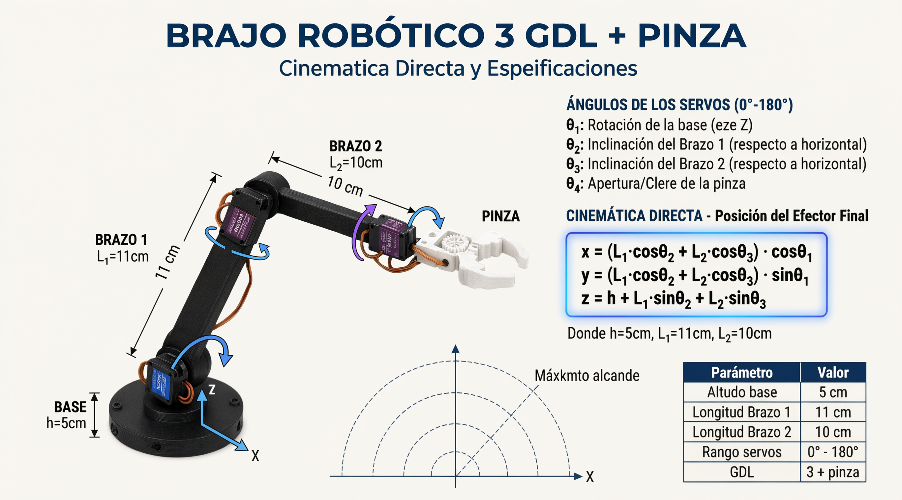
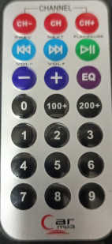
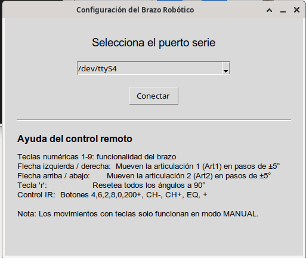
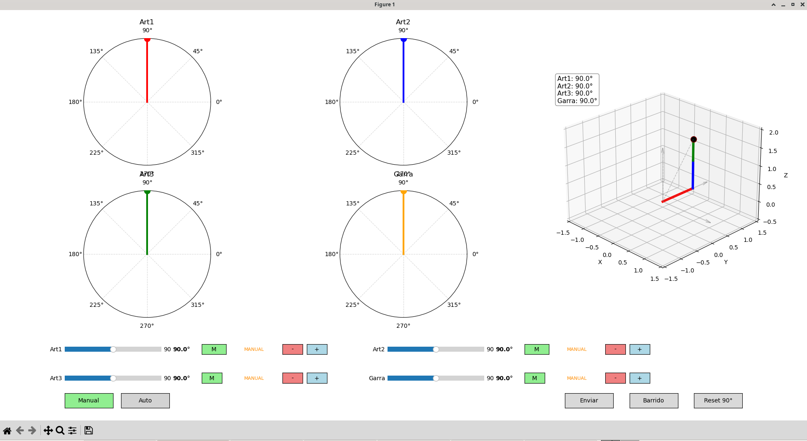

# Control de un Brazo con Tres (3) Grados de Libertad

En la infografía se puede ver la cinematica del sistema a controlar

## Maqueta

La maqueta esta compuesta por cuatro (4) servo motores SG90 Controlados de tres formas diferentes:

1. Teclado
2. Joytick
3. Control Remoto Infrarojo

## Servo Motores
1. Canal 12: Base
2. Canal 13: Articulación 1 (Brazo 1)
3. Canal 14: Articulación 2 (Brazo 2)
4. Canal 15: Garra

## Componentes de la Maqueta
1. Cuatro (4) Servos MG90 de 0 a 180°
2. Modulo  PCA9685
3. IR (KY-022)
4. Dos (2) JOYSTICK
5. Control Remoto

## Software Desarrolado

### **Arduino**

#### Calibrar.ino

Permite calibrar el recorrido de los servo motores utilizando el modulo PCA9685, controlado por el joytick o teclado, se puede especificar el canal a controlar del modulo

#### garra.ino
Permite calibara la garra del canal 15 desde el teclado

#### control.ino
Permite el control del brazo mecánico mediante el uso de los dos joystick el primero controla rotación de la base y la garra, el segundo la inclinación de los brazos  

#### control2.ino
Permite el control del brazo mecánico desde los dos joystick o usando el teclado numérico.

### control4.ino
Permite el control del brazo mediante joystick o el teclado numerico, con posibilidad de colocar cada servo en manual o automatico para dejar una posición fija

### control6.ino
Permite el control del brazo mediante joystick, el teclado numerico o mediante control remoto

Permite la calibración del HEX de cada boton del control Remoto a utilizar, para este caso el mapeo del control es el siguiente:

- Boton_1, 	0xF30CFF00
- Boton_2, 	0xE718FF00
- Boton_3,	0xA15EFF00
- Boton_4,	0xF708FF00
- Boton_5,	0xE31CFF00
- Boton_6,	0xA55AFF00
- Boton_7,	0xBD42FF00
- Boton_8,	0xAD52FF00
- Boton_9,	0xB54AFF00
- Boton_0,	0xE916FF00
- Boton_100+,	0xE619FF00
- Boton_200+,	0xF20DFF00
- Boton_-,	0xF807FF00
- Boton_+,	0xEA15FF00
- Boton_EQ,	0xF609FF00
- Boton_<,	0xBB44FF00
- Boton_>,	0xBF40FF00
- Boton_>|,	0xBC43FF00
- Boton_CH-,	0xBA45FF00
- Boton_CH,	0xB946FF00
- Boton_CH+,	0xB847FF00

### Python

Se desarrollaron interfaz gráficas para monitorear el movimiento del brazo con Python 

#### control_2.py
se usa en conjunto con **control4.ino** permite monitorear el movimiento desde una interfaz grafica que se puede manejar para los dos modos de control. 
Este programa supone que el arduino esta conectado al puerto /dev/ttyUSB0.

### control_4.py
se usa en conjunto con **control6.ino** permite monitorear el movimiento desde una interfaz grafica que se puede manejar para los tres modos de control. 

 
En la figura se presenta la interfaz de conexion al puerto de comunicación con el arduino

En la figura se presenta la interfaz de control en python

