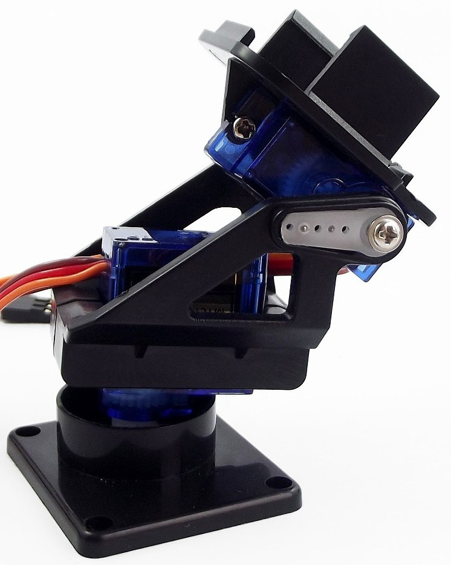

# Laboratorio de Electrónica de Potencia
 Códigos y Programas del Laboratorio de Electrónica de Potencia USB
 En este repositorio se incluyen las guías de laboratorio, y los códigos de arduino y python para las diferentes actividades.
 
## Maquetas
 
 1. Móvil de dos (2) ejes con servomotor
 
 2. Brazo Mecánico con tres ejes de libertad con servomotores
 
 3. Inversores Monofásicos
 4. Inversores Trifásicos
 5. Troceadores o Chopper
 
Estos son los códigos de programación de los arduinos para las Prácticas 4, 5 y 6 